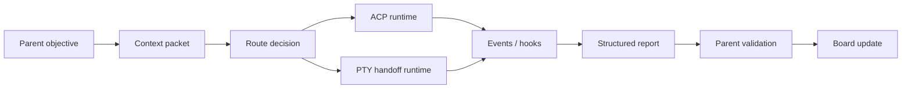

# AgentCall v0.5.1 架构整理

v0.5.1 的核心变化不是“又多一个 hook”，而是把主程也纳入工程纪律：Codex 可以被 hook 提醒、被 MCP preflight 约束，也可以把 Claude/ACP/PTY 子任务的状态统一拉回 AgentCall board。

## 一句话结论

AgentCall 现在按三层收敛：

- `web/`：前端可视化，只负责看得见、点得动、状态好扫。
- `src/agentcall/`：Python 胶水层，保留 CLI、ACP 适配和测试友好的编排代码。
- `crates/`：Rust 后端层，负责速度敏感和进程边界清晰的能力，包括 MCP、hook 接收、PTY daemon。

## 为什么 Codex 也需要 hooks

MCP 能让 Codex “知道有工具可用”，但它不能保证 Codex 每次都在正确时机调用工具。hook 的价值是把提醒前置：

- `SessionStart`：把 AgentCall 当前 workspace 状态注入给 Codex。
- `UserPromptSubmit`：在每轮用户输入前提醒 Codex 查 board、route、claims、reports。
- `Stop/PreCompact/PostCompact`：记录 Codex 自己的生命周期状态，避免主程也变成黑盒。

这不是让 hook 替 Codex 思考，而是让 hook 负责“该想起来的时候想起来”。

## Codex Hook 接入

项目级配置写入：

```text
.codex/hooks.json
```

安装：

```powershell
cargo build -p agentcall-hook
.\scripts\install-codex-hooks.ps1 -Root E:\Project\AgentCall
```

当前安装的事件：

```text
SessionStart
UserPromptSubmit
Stop
PreCompact
PostCompact
```

hook 调用的后端是：

```text
target\debug\agentcall-hook.exe
```

它会读取 stdin JSON，写入 `.agentcall/events.ndjson` 和 `.agentcall/state/active_sessions.json`，并在 `SessionStart/UserPromptSubmit` 返回 Codex 可读的 `additionalContext`。

## Claude Code Hook 接入

Claude Code 继续使用同一个 Rust hook 后端：

```powershell
cargo build -p agentcall-hook
.\scripts\install-claude-hooks.ps1 -Root E:\Project\AgentCall
```

比 Codex 多出来的关键点是 `PreToolUse/PostToolUse`：

- `PreToolUse` 对 `Edit/MultiEdit/Write/NotebookEdit` 做 file claim。
- 如果另一个 session 已经 active claim 同一文件，hook 返回 deny。
- `Stop/SubagentStop/SessionEnd` 释放该 session 的 active claims。

## MCP Preflight

新增 MCP 工具：

```text
agentcall_codex_preflight
```

用途是把“主程该查什么”结构化返回给 Codex：

- `turn_start`：建议先查 board；有 objective 时建议 route。
- `before_edit`：建议查 file claims。
- `before_final`：建议查 reports/events，不要机械写 review。

返回里包含：

- `required_checks`
- `next_actions`
- `warnings`
- `summary`
- `route_model`

这层是 Codex hooks 和 MCP 的桥：hook 负责提醒，MCP 负责给结构化状态。

## ACP 与 PTY 的统一模型

ACP 和 PTY 不再是两条互斥路线。它们共享同一条生命周期：



唯一差异是 route/runtime adapter：

- ACP：对子 Agent 友好，适合 bounded child lifecycle、结构化调用、token 可控。
- PTY：对人类可视化友好，适合长生命周期 handoff、debug、需要看到真实终端状态的任务。

## 当前边界

Python 还没有完全退出后端：

- ACP driver 和 workflow simulation 仍在 Python。
- CLI 仍在 Python，因为它适合作为胶水和测试入口。
- Rust hook 已经接管 hook ingestion 的核心状态写入与 file claim。

这个边界是有意的：不要为了“全 Rust”把能跑通的 orchestration 胶水变复杂；但凡涉及高频 hook、进程 I/O、MCP/PTY 服务边界，都优先 Rust。

## v0.5.1 的工程约束

- Review 只在发现问题、漂移、阻塞、低信心时写。
- 子 Agent 完整生命周期结束必须有 report。
- 主程不能让子 Agent 猜上下文，要用 context packet、board、reports、events 显式交付。
- SOP 尽量变成代码：hook、preflight、claim、report schema、route policy。
- pytest 临时目录统一放到 `.agentcall_pytest/`，不再用一堆 `.pytest_tmp*` 淹没项目根目录。
